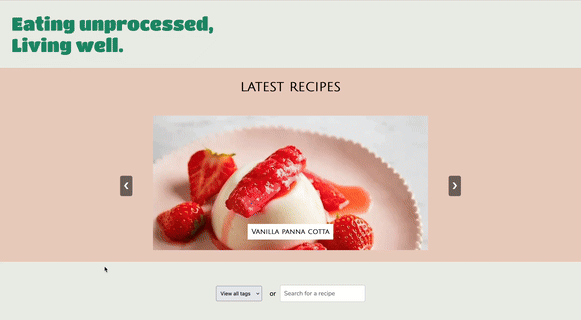
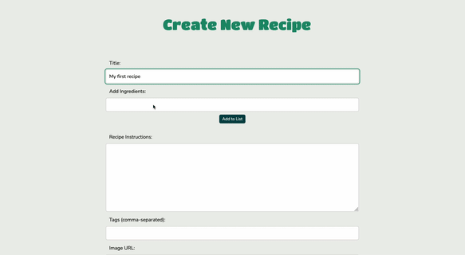

# 

Welcome to the "Eating Unprocessed - Living Well" project. This project is a web application focused on providing users with a platform to share and discover recipes for a healthier, unprocessed lifestyle.

## Table of Contents 📚

1. [Project Overview](#project-overview)
2. [Demo](#demo)
3. [Features](#features)
4. [Installation ](#installation)
5. [Usage](#usage)
6. [License](#license)

## Project Overview 📝

"Eating Unprocessed - Living Well" is a responsive web application built using HTML, CSS, and JavaScript. It allows users to create, view, edit, and delete blog posts related to unprocessed food recipes. The application is designed to be accessible and easy to navigate, ensuring a seamless user experience.

## Demo 💡

index.html  
  
make.html  

## Features ✨

🔐 Admin

- User Authentication: Implement secure login and registration functionalities for users.
- Blog Post Management: Enable CRUD (Create, Read, Update, Delete) operations for blog posts.

🙋‍♀️ End-User

- Search and Filter: Include features for filtering and searching blog posts.
- Latest Posts Carousel: Display the latest posts in a carousel format, with swipe functionality on mobile devices.

🔎 Accessibility

- ARIA Compliance: Incorporate accessible components that comply with ARIA standards.
- Responsive Design: Ensure the website is fully responsive and optimized for mobile and desktop.

## Installation 🎥

To launch this project, click on one of the following links:  
🙋‍♀️ [User-Environment](https://fed1-exam-julieoyen.netlify.app/)  
🔐 [Admin-Environment](https://fed1-exam-julieoyen.netlify.app/account/login.html)

## Usage 🔧

### Register ✍️

1. Open the registration page by navigating to `/account/register.html`.
2. Fill out the registration form.
3. Click the "REGISTER" button to create a new account.  
   **Note:** Registering an account will not display any blog posts from this blog. You must be logged in to juloye51070@stud.noroff.no to edit/delete/create posts due to endpoint hard coding.

### Login 🔑

1. Open the login page by navigating to `/account/login.html`.
2. Enter your email and password.
3. Click the "LOGIN" button to log in.

### Creating a New Recipe Post 🥗

1. Navigate to `/post/make.html`.
2. Fill out the form with the recipe details.
3. Click the "Save" button to create the post.

### Viewing and Editing Posts 📝

1. Navigate to the dashboard at `/post/index.html` to view all posts.
2. Click on a post title to view it.
3. To edit or delete a post, use the provided buttons.

## Technology Used 💻

- HTML, CSS, JavaScript
- Figma
- Noroff Blog API
- Netlify (For deploy of live page)

## License 📜

This project is licensed under the MIT License. See the [LICENSE](LICENSE) file for more details.
